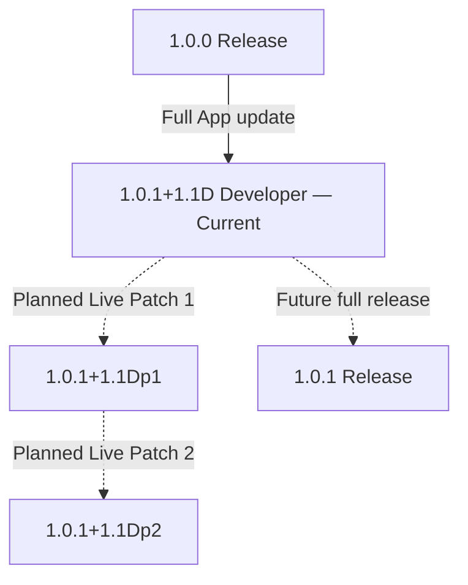

# Panel Version Timeline

## Current version

- App version: `1.0.1`
- Developer Build: `1.0.1+1.1D`
- Electron update version: `1.0.1-alpha.1`
- Update channel: `Developer` (`alpha`)
- Live Patch compatibility: `>=1.0.1-alpha.1 <1.0.2`
- Active Patch: none

## Update rules

- `1.0.0` to `1.0.1+1.1D` is a Full App update using the DMG or automatic-update ZIP.
- A device must run a compatible `1.0.1` build before it can accept the `1.0.1` Live Patch.
- `p1`, `p2`, and later suffixes identify accepted signed Live Patches.
- Each new Patch replaces the previous Patch configuration; Patch files are not stacked.
- Electron, Python, HTML, arbitrary JavaScript, preload code, and security-sensitive behavior require a Full App update.
