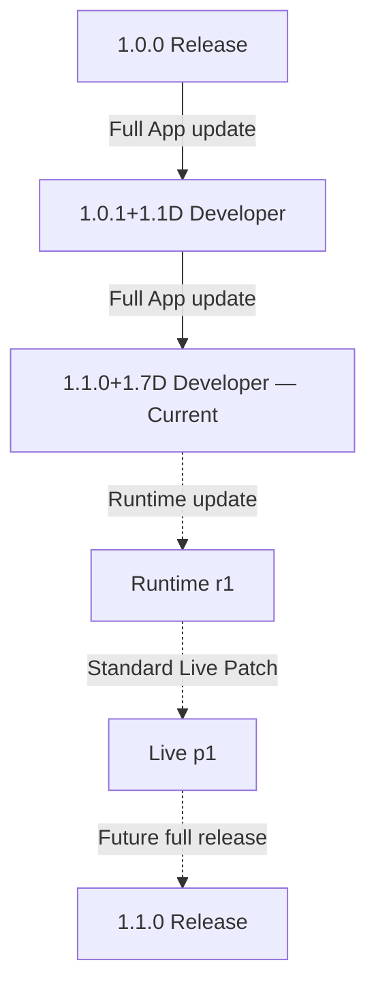

# Panel Version Timeline

```mermaid
graph TD
    V100["1.0.0 Release"] -->|"Full App update"| V101D["1.0.1+1.1D Developer"]
    V101D -->|"Full App update"| V110D["1.1.0+1.7D Developer — Current"]
    V110D -.->|"Runtime update"| R1["Runtime r1"]
    R1 -.->|"Standard Live Patch"| P1["Live p1"]
    P1 -.->|"Future full release"| V110R["1.1.0 Release"]
```

## Current version

- App version: `1.1.0`
- Developer Build: `1.1.0+1.7D`
- Electron update version: `1.1.0-alpha.1`
- Update channel: `Developer` (`alpha`)
- Live Patch compatibility: `>=1.1.0-alpha.1 <1.1.1`
- Active Patch: none

## Update rules

- `1.0.1+1.1D` to `1.1.0+1.7D` is a Full App update using the DMG or automatic-update ZIP.
- A device must run the compatible `1.1.0` Baseline before it can accept a `1.1.0` Runtime package.
- Runtime packages can replace allowlisted Renderer and Python code with A/B rollback.
- `p1`, `p2`, and later suffixes identify accepted signed Live Patches.
- Each new Patch replaces the previous Patch configuration; Patch files are not stacked.
- Electron main, preload, Rust, trust keys, native dependencies, and security-sensitive
  Bootstrap behavior require a Full App update.
