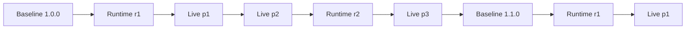

# Panel Three-Tier Update Architecture

This document records the agreed update architecture, security boundaries, version
model, and operator workflow for Panel.

## Status

| Update tier | Status | Activation |
| --- | --- | --- |
| Full Version Update | Available | User approves, then Electron `quitAndInstall` |
| Runtime Update | Planned for a future Baseline | User approves, Updating screen, A/B switch, micro-restart |
| Standard Live Patch | Available | Automatic, immediate, health checked |

Runtime Update commands do not exist yet. A Full Version Update must first add the
immutable Bootstrap, signed runtime-package format, A/B slots, Updating screen,
health protocol, and rollback supervisor.

## Design principles

1. A Full Version Update can replace every Panel component.
2. A Runtime Update can replace feature code while preserving the immutable trust
   root.
3. A Standard Live Patch can automatically change only validated data, appearance,
   rules, and preinstalled feature flags.
4. Every downloaded payload is signed, version constrained, replay protected, and
   health checked before it becomes trusted state.
5. The Bootstrap, signature verifier, embedded root public keys, rollback manager,
   Updating screen, and process launcher cannot update themselves. They change only
   through a Full Version Update.
6. Every accepted Runtime or Live Patch change is absorbed into the next Baseline.

## Tier 1: Full Version Update

### Scope

A Full Version Update may replace everything, including:

- Rust or Electron Bootstrap
- Electron and native dependencies
- main process, preload, IPC, Renderer JavaScript, HTML, and CSS
- Python services
- update and Patch verifiers
- embedded public keys
- macOS entitlements, icons, and signed App resources
- runtime and state schema versions

### Operator workflow

1. Choose the next semantic App version and Build identifier.
2. Update `VERSION.json`, `package.json`, package lock metadata, visible versions,
   tests, README, release notes, and output paths.
3. Merge all accepted Runtime and Live Patch behavior into the source Baseline.
4. Run:

   ```bash
   npm test
   npm audit --audit-level=low
   git diff --check
   ```

5. Build and verify:

   ```bash
   npm run dist
   hdiutil verify 'dist/<appVersion>/<build>/panel.dmg'
   unzip -tq 'dist/<appVersion>/<build>/panel.zip'
   codesign --verify --deep --strict 'dist/<appVersion>/<build>/mac-arm64/Panel.app'
   shasum -a 256 'dist/<appVersion>/<build>/panel.dmg'
   ```

6. Scan the staged source and artifacts for credentials.
7. Commit, push a branch, merge a reviewed PR, and create an annotated tag.
8. Upload the DMG, ZIP, block maps, channel metadata, and `VERSION.json` to the
   matching GitHub release.
9. Panel downloads the update only after the user approves it and activates it with
   `quitAndInstall`.

Use a prerelease package version and `alpha-mac.yml` for Developer builds. Use a
stable semantic version and `latest-mac.yml` for public Stable builds.

## Tier 2: Runtime Update

### Scope

A Runtime Update is intended to replace:

- HTML, CSS, Renderer JavaScript, and Widgets
- Python services
- images, fonts, and feature assets
- feature logic
- main and preload code only when the Bootstrap API remains compatible

Changing main or preload requires an automatic Electron micro-restart. It is not
an in-memory code replacement.

### Package model

The future build command will produce an immutable package such as:

```text
panel-runtime-r3.zip
├── manifest.json
├── renderer/
├── electron/
├── python/
└── assets/
```

The signed manifest must contain the runtime revision, channel, Baseline range,
Bootstrap and Runtime API versions, sequence, issue and expiry times, and the
SHA-256 digest and size of every file.

### Planned operator workflow

1. Modify HTML, CSS, JavaScript, Python, or other runtime source normally.
2. Increase `runtimeRevision` and the anti-replay sequence.
3. Run the complete test and dependency audit suite.
4. Build a deterministic Runtime ZIP and manifest.
5. Sign the manifest with the matching offline Ed25519 channel key.
6. Upload the package and signed manifest without modifying an existing revision.
7. Commit and push the public metadata.
8. Panel shows a Runtime Update card; it does not install automatically.
9. After approval, the immutable Bootstrap displays the Updating screen with
   download, verification, staging, switching, restart, and health-check progress.
10. The Bootstrap activates the pending A/B slot only after health confirmation and
    restores the previous slot after failure.

This workflow is a design contract, not a currently available command sequence.

## Tier 3: Standard Live Patch

### Scope

Standard Live Patches may update validated fields such as:

- status colors and thresholds
- refresh policy
- Settings title, labels, and field order
- update-card text and allowlisted visual tokens
- future Task and Calendar appearance schemas
- future dashboard layout schemas
- rules and feature flags implemented by the installed Baseline

They cannot contain arbitrary HTML, CSS, JavaScript, Python, preload, Electron main
code, credentials, endpoints, or changes to the trust root.

### Operator workflow

1. Edit only `patches/developer-live-patch.example.json` for a Developer Patch.
2. Give the Patch a unique `patchId`.
3. Increase `patchNumber` so the Build displays the new `pN` suffix.
4. Increase `sequence`. Never reuse a sequence, including after rollback.
5. Set a narrow, tested `appVersionRange` and `lifetimeDays` from 1 to 30.
6. Run `npm test` and validate the draft JSON.
7. Move the previous signed output to a local temporary backup; never edit a signed
   envelope by hand.
8. Sign the new draft:

   ```bash
   PANEL_PATCH_SIGNING_KEY='/Users/yu/Library/Application Support/Panel Developer/update-signing/developer-private.pem' \
   PANEL_PATCH_KEY_ID='panel-developer-2026-01' \
   npm run sign:patch -- \
   patches/developer-live-patch.example.json \
   patches/developer-live-patch.json
   ```

9. Stage only the draft, signed envelope, and matching tests. Run Gitleaks against
   the staged tree.
10. Commit and push `main`. No GitHub tag or Release is required.
11. Confirm the raw manifest returns HTTP 200 and the expected Patch number.
12. Developer devices check automatically after launch and every four hours, or
    immediately when Check for updates is clicked.
13. Confirm the runtime Build has the expected `pN` suffix and the local Patch state
    reports a completed health check.

The fixed Developer manifest URL is:

```text
https://raw.githubusercontent.com/YuYu9372/Panel/main/patches/developer-live-patch.json
```

## Version model

The development metadata should eventually expose each independently changing
layer:

```json
{
  "appVersion": "1.0.1",
  "build": "1.0.1+1.1D",
  "runtimeRevision": 2,
  "livePatchNumber": 3,
  "bootstrapApiVersion": 1,
  "runtimeApiVersion": 1
}
```

A compact development display may use:

```text
1.0.1+1.1D-r2-p3
```

The public interface continues to show only the App version.

## Baseline lifecycle



Runtime and Live Patch counters may restart after a new Baseline. Compatibility is
defined by explicit Baseline and API contracts, not by an unbounded version range.

## Decision guide

Use Full Version Update when changing the trust root, Bootstrap, Electron version,
native code, entitlements, updater, public keys, or incompatible APIs.

Use Runtime Update when shipping feature code, HTML, CSS, JavaScript, Python, or
assets while the installed Bootstrap contract remains compatible.

Use Standard Live Patch when changing validated appearance, configuration, rules,
or an already-installed feature flag without executing downloaded code.
