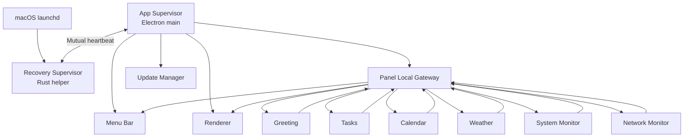
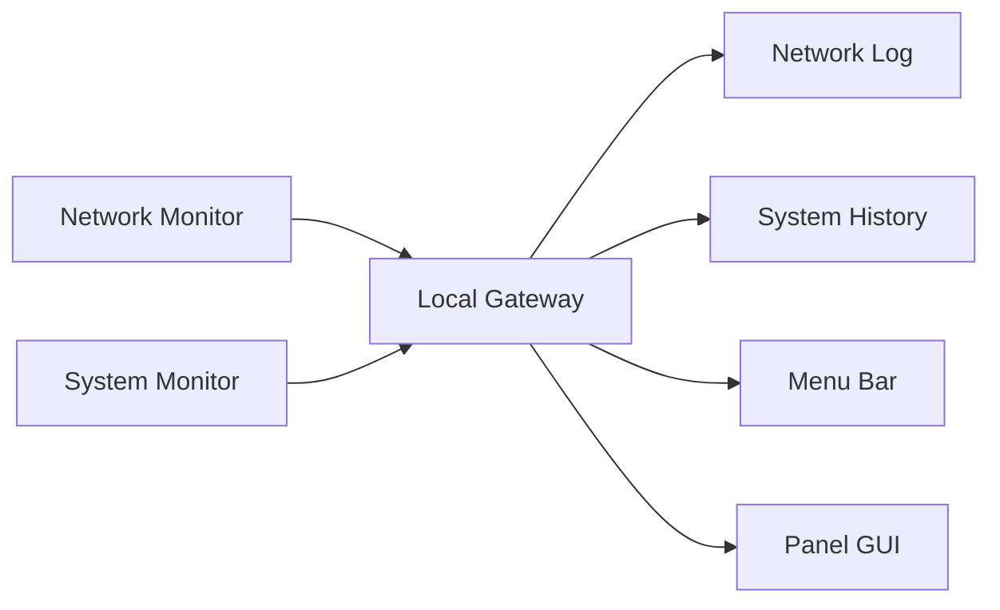

# Architecture

## Design principle

Panel will be a supervised modular application, not a collection of unrelated
microservices. Modules remain small and independently observable, while shared
processes and APIs keep resource usage and packaging manageable.

Data and lifecycle control have separate owners:

```text
Supervisor = manages processes and module lifecycle
Gateway = manages data, events, and snapshots
Watchdog = detects missing or unhealthy heartbeats
```

## Control and data flow



## App Supervisor

The App Supervisor runs in Electron main and manages Panel internals:

- Python Gateway process
- Renderer readiness and reload
- Menu Bar creation and recreation
- Network and System workers
- optional data modules
- Runtime activation and rollback coordination
- module registry and dependency state

It may restart one module without quitting the rest of Panel.

## Recovery Supervisor

The Recovery Supervisor is a small separate Rust process. It does not own
weather, calendar, network data, or UI state. It monitors the whole Panel App:

- Electron process presence
- App Supervisor heartbeat
- functional health, not only process presence
- crash-loop detection
- expected update and shutdown maintenance windows
- whole-App restart and Safe Mode entry

The App Supervisor and Recovery Supervisor detect each other, but they do not
have equal authority. The Recovery Supervisor may restart Panel. The App
Supervisor reports a missing Recovery Supervisor and lets `launchd` restore it.
This prevents two recovery helpers and avoids restart wars.

## Heartbeat transport

Mutual heartbeats should use an owner-only Unix domain socket inside Panel's
user-data directory. No public network port is required.

```json
{
  "schemaVersion": 1,
  "supervisor": "app",
  "generation": 42,
  "pid": 12345,
  "state": "healthy",
  "heartbeatAt": "2026-08-02T15:20:02Z"
}
```

The protocol must allow only fixed commands such as `heartbeat`, `status`,
`maintenance`, `restart-request`, and `safe-mode-request`. It must never accept
arbitrary commands, paths, scripts, or environment variables.

## Local Gateway

The Local Gateway is Panel's single source of truth for current data and module
events. Consumers do not run their own network or sensor probes.



Existing `/api/net` and `/api/history` endpoints should remain as compatibility
views backed by Gateway state. New read-only endpoints may expose Gateway status
and bounded event history.

Management actions must pass through narrow Electron IPC and the App
Supervisor. A dashboard Renderer must not receive arbitrary process-control
access.

## Module boundaries

Use the lightest safe isolation level:

- Renderer widgets can be reinitialized or the Renderer can be reloaded.
- Data providers can run as restartable Gateway tasks.
- Blocking or crash-prone probes can use isolated workers.
- The Python Gateway remains a separate process supervised by Electron.
- The Recovery Supervisor remains outside Electron.

Every widget does not need a separate operating-system process.
